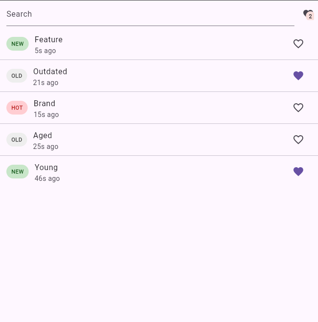

# mini_app

## Notes
 - First step was define the data structure
 - Then create a mock API to retrieve data
 - Create page to list the data
 - Add textfield to filter data
 - Insert a new param to repository to filter data

## Technical decisions
 - Use of BloC to manage state because I have more familiarity.
 - Didn't add any dependecy injection because of deadline.
 - Adopted the DDD (Domain-Driven-Design) for architecture
 - Separated Controllers to list items and favorite them to avoid large files

